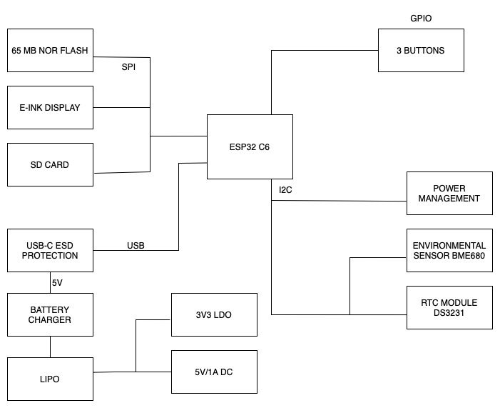

# Proiect TSC

## Chitan Rafael-Alexandru - 332CA

# Diagrama block

# Descrierea componentelor hardware

## Microcontroller – ESP32-C6

- **Arhitectura:** RISC-V 32-bit
- **Conectivitate:** WiFi 6, Bluetooth Low Energy 5.0
- **Interfete:** SPI, I2C, UART, PWM, GPIO
- **Consum redus:** suporta moduri de somn (deep sleep)

---

## E-Paper Display

- **Conectare:** 20 pini prin header dedicat
- **Control:** SPI + GPIO
  - Semnale: `EPD_CS`, `EPD_DC`, `EPD_RST`, `EPD_BUSY`, etc.
- **Avantaje:** consum 0 in standby, lizibilitate excelenta in lumina naturala

---

## Senzor de Mediu – BME688

- **Functii:** Temperatura, Umiditate, Presiune, Calitate aer (VOCs)
- **Comunicare:** I2C
  - SDA: `IO1`
  - SCL: `IO2`
- **Tensiune:** 3.3V
- **Adresa I2C:** `0x76`

---

## RTC – DS3231SN

- **Functie:** Timp real cu precizie ±2 ppm
- **Interfata:** I2C (SDA/SCL comune)
- **Backup:** Supercapacitor

---

## Alimentare si Baterie

### MAX17048 – Fuel Gauge

- **Functie:** Monitorizare nivel baterie LiPo
- **Comunicare:** I2C (`IO1`, `IO2`)

### MCP73831 – Battery Charging Controller

- **Incarcare:** 1 celula LiPo (USB → 3.7V)
- **Curent:** ~500 mA
- **Status LED:** Incarcare finalizata / in curs

### XC6204 – LDO Regulator

- **Intrare:** 5V (USB)
- **Iesire:** 3.3V
- **Curent maxim:** 200 mA
- **Consum in standby:** < 1 µA

---

## Stocare

### SD Card (microSD)

- **Interfata:** SPI (IO4–IO9)
- **Functie:** Salvare fisiere eBook, configurari

### NOR Flash – W25Q512JV (64MB)

- **Interfata:** SPI (dedicat: IO20–IO23)
- **Functie:** Stocare firmware, fonturi, assets

---

## Voltage Supervisor & Reset

- **Componenta:** BD52xx
- **Functie:** Monitorizare tensiune si reset sigur
- **Boot/Reset GPIO:** `IO0`

---

## I2C Extensii – Qwiic / Stemma QT

- **Conector:** 4 pini (3V3, GND, SDA, SCL)
- **Interfata:** I2C (`IO1`, `IO2`)
- **Compatibil:** Adafruit / SparkFun senzori si periferice

---

## Estimare Consum de Energie

| Componenta             | Activ          | Standby       |
|------------------------|----------------|---------------|
| ESP32-C6               | 80–150 mA      | <10 µA        |
| E-Paper                | 20–30 mA       | 0 µA          |
| BME688                 | 1.1 mA         | 0.15 µA       |
| RTC DS3231SN           | 200 µA         | 2 µA          |
| SD Card                | 20–100 mA      | 0.2 µA        |
| MAX17048               | 50 µA          | 1 µA          |
| NOR Flash              | 20 mA          | 5 µA          |

---

## Test Pads & Protectie ESD

- **Protectii:** TVS diode pe USB, SPI si I2C
- **Test Pads:** disponibile pentru debugging si masuratori

---

## Pin Mapping – ESP32-C6

| Functie                | GPIO Pins           |
|------------------------|---------------------|
| SD Card (SPI)          | IO4, IO5, IO6, IO9  |
| E-Paper Display        | IO10–IO19           |
| I2C (RTC, Sensor, Fuel)| IO1 (SDA), IO2 (SCL)|
| SPI Flash extern       | IO20–IO23           |
| Reset / Boot Button    | IO0                 |

## Bill of Materials
| Componenta | Link | Datasheet |
|-----------|--------------|-----------|
| BUTTON | [Model](https://industry.panasonic.com/global/en/products/control/switch/light-touch/number/evqpuj02k) | [Datasheet](https://www.lcsc.com/datasheet/lcsc_datasheet_2201121800_PANASONIC-EVQPUJ02K_C2936858.pdf) |
| CAPACITOR | [Model](https://componentsearchengine.com/part-view/R0402%201%25%20100%20K%20(RC0402FR-07100KL)/YAGEO) | [Datasheet](//efaidnbmnnnibpcajpcglclefindmkaj/https://www.resistor.com/assets/pdf/0402tstd.pdf) |
| CPH3225A | [Model](https://www.snapeda.com/parts/CPH3225A/Seiko+Instruments/view-part/?ref=eda) | [Datasheet](https://octopart.com/datasheet/cph3225a-seiko-25340571) |
| EVQPUJ02K | [Model](https://industry.panasonic.com/global/en/products/control/switch/light-touch/number/evqpuj02k) | [Datasheet](https://www.lcsc.com/datasheet/lcsc_datasheet_2201121800_PANASONIC-EVQPUJ02K_C2936858.pdf) |
| KP-1608SURCK | [Model](https://www.snapeda.com/parts/KP-1608SURCK/Kingbright/view-part/?ref=search&t=LED%200603) | [Datasheet](//efaidnbmnnnibpcajpcglclefindmkaj/https://media.elv.com/file/107153_led_surck1608_data.pdf) |
| USBLC6-2SC6Y | [Model](https://www.snapeda.com/parts/USBLC6-2SC6Y/STMicroelectronics/view-part/?ref=eda) | [Datasheet](https://www.digikey.com/en/htmldatasheets/production/1375342/0/0/1/usblc6-2sc6y) |
| SD0805S020S1R0 | [Model](https://ro.mouser.com/ProductDetail/KYOCERA-AVX/SD0805S020S1R0?qs=jCA%252BPfw4LHbpkAoSnwrdjw%3D%3D) | [Datasheet](https://www.alldatasheet.com/view.jsp?Searchword=SD0805S&sField=2) |
| PGB1010603MR | [Model](https://www.snapeda.com/parts/PGB1010603MR/Littelfuse/view-part/?ref=eda) | [Datasheet](https://www.alldatasheet.com/view.jsp?Searchword=Pgb1010603mr&gad_source=1&gbraid=0AAAAADcdDU8aYfZtfJfdZ9I5j6RwZ_cbA&gclid=Cj0KCQjwqcO_BhDaARIsACz62vOPBOBe0eOh5gDUFkkKl4JBcbmoFZYtJ8BOnbaWqr_BuUCcVWvbutAaAmGkEALw_wcB) |
| BD5229G-TR  | [Model](https://componentsearchengine.com/part-view/BD5229G-TR/ROHM%20Semiconductor) | [Datasheet](https://www.lcsc.com/datasheet/lcsc_datasheet_2201131330_ROHM-Semicon-BD5229G-TR_C962636.pdf) |
| XC6220A331MR-G | [Model](https://componentsearchengine.com/part-view/XC6220A331MR-G/Torex) | [Datasheet](https://www.alldatasheet.com/view.jsp?Searchword=Xc6220&gad_source=1&gbraid=0AAAAADcdDU8aYfZtfJfdZ9I5j6RwZ_cbA&gclid=Cj0KCQjwqcO_BhDaARIsACz62vPS06NB6tLgniZzfaVpKNu1m811BNk6AEPfg4DbP6f5S8QWA_pW_UQaAv-0EALw_wcB) |
| XC6220A331MR-G | [Model](https://componentsearchengine.com/part-view/XC6220A331MR-G/Torex) | [Datasheet](https://www.alldatasheet.com/view.jsp?Searchword=Xc6220&gad_source=1&gbraid=0AAAAADcdDU8aYfZtfJfdZ9I5j6RwZ_cbA&gclid=Cj0KCQjwqcO_BhDaARIsACz62vMO5_aHsn35cIZBK6oCFuB_WOxz_zKu4yOHJ69-EnaUd5Jfas_Avm8aAuk5EALw_wcB) |
| USB4110-GF-A  | [Model](https://componentsearchengine.com/part-view/USB4110-GF-A/GCT%20(GLOBAL%20CONNECTOR%20TECHNOLOGY)) | [Datasheet](//efaidnbmnnnibpcajpcglclefindmkaj/https://gct.co/files/drawings/usb4110.pdf) |
| Adafruit | [Model](https://eu.mouser.com/ProductDetail/Adafruit/4208?qs=PzGy0jfpSMtbScLbr0L5dw%3D%3D) | [Datasheet](https://www.arrow.com/en/manufacturers/adafruit-industries/datasheets) |
| Bobina | [Model](https://store.comet.srl.ro/Catalogue/Product/43497/) | [Datasheet](https://www.scribd.com/document/814581278/Datasheet-Bobina) |
| PFMF | [Model](https://www.mouser.co.uk/ProductDetail/EPCOS-TDK/B72520T0350K062?qs=dEfas%2FXlABIszF52uu7vrg%3D%3D) | [Datasheet](https://ro.mouser.com/c/ds/circuit-protection/thermistors/resettable-fuses-pptc/?m=Schurter&series=PFMF) |
| DMG2305UX-7 | [Model](https://componentsearchengine.com/part-view/DMG2305UX-7/Diodes%20Incorporated) | [Datasheet](//efaidnbmnnnibpcajpcglclefindmkaj/https://www.mouser.com/datasheet/2/115/DMG2305UX-266242.pdf?srsltid=AfmBOop22k34YTJJra1xubiU6LPiN4M4JlcWbRoSNdxSGFak8uWgXPpK) |
| Si1308EDL-T1-GE3 | [Model](https://componentsearchengine.com/part-view/SI1308EDL-T1-GE3/Vishay) | [Datasheet](https://www.alldatasheet.com/view.jsp?Searchword=Si1308edl&gad_source=1&gbraid=0AAAAADcdDU-px713ONYSnQ2O-gcwqYcFq&gclid=Cj0KCQjwqcO_BhDaARIsACz62vN_Nz3MJOc6J_03gnVBm7aSqC8v9wyP0VD-iRKP-gFrYgdhLi99I14aAlVJEALw_wcB) |
| R0402 | [Model](https://componentsearchengine.com/part-view/R0402%201%25%20100%20K%20(RC0402FR-07100KL)/YAGEO) | [Datasheet](//efaidnbmnnnibpcajpcglclefindmkaj/https://www.resistor.com/assets/pdf/0402tstd.pdf) |
| BME680 | [Model](https://www.snapeda.com/parts/BME680/Bosch/view-part/?welcome=home) | [Datasheet](//efaidnbmnnnibpcajpcglclefindmkaj/https://www.bosch-sensortec.com/media/boschsensortec/downloads/datasheets/bst-bme680-ds001.pdf) |
| SMD Solder | [Model](https://grabcad.com/library/solder-jumpers-1) | [Datasheet]() |
| W25Q512JVEIQ | [Model](https://www.snapeda.com/parts/ESP32-C6-WROOM-1-N8/Espressif+Systems/view-part/?ref=eda) | [Datasheet](//efaidnbmnnnibpcajpcglclefindmkaj/https://www.mouser.com/datasheet/2/949/W25Q512JV_SPI_RevB_06252019_KMS-2487502.pdf?srsltid=AfmBOoquExqDVgxEELF9CzuOGxHos0CD1nQDROHD6Eebdm2foNzqozqU) |
| ESP32-C6-WROOM-1-N8 | [Model](https://www.snapeda.com/parts/ESP32-C6-WROOM-1-N8/Espressif+Systems/view-part/?ref=eda) | [Datasheet](//efaidnbmnnnibpcajpcglclefindmkaj/https://www.mouser.com/catalog/specsheets/Espressif_ESP32_C6_WROOM_1%20_Datasheet_V0.1_PRELIMINARY_en.pdf?srsltid=AfmBOooHQKNitqODRaaPjoZInfWKTacDER1t5uRK6sKqT13TrzvVo_B7) |
| DS3231SN# | [Model](https://www.snapeda.com/parts/DS3231SN%23/Analog+Devices/view-part/?ref=eda) | [Datasheet](https://www.alldatasheet.com/view.jsp?Searchword=Ds3231sn%20datasheet&gad_source=1&gbraid=0AAAAADcdDU-Gy9URfMxGmqiPg7ci5L3wR&gclid=Cj0KCQjwqcO_BhDaARIsACz62vMkK3ETSnW2w7mo0Fa-wgWJGn89AxWCyIND6k5X8MmoPl6hv6VWwT8aAiS-EALw_wcB) |
| MAX17048G+T10 | [Model](https://www.snapeda.com/parts/MAX17048G+T10/Analog+Devices/view-part/?ref=eda) | [Datasheet](https://www.alldatasheet.com/view.jsp?Searchword=Max17048&gad_source=1&gbraid=0AAAAADcdDU8aYfZtfJfdZ9I5j6RwZ_cbA&gclid=Cj0KCQjwqcO_BhDaARIsACz62vNa9xrVfzjCjADRwXD0RBbo4Nret3ywwteDGLJKZui8ZL8KdVlTE7caAvQxEALw_wcB) |
| MCP73831T-5ACI/OT | [Model](https://www.mouser.co.uk/ProductDetail/Microchip-Technology/MCP73831T-5ACI-OT?qs=hH%252BOa0VZEiAcgAcEkuamXg%3D%3D) | [Datasheet](//efaidnbmnnnibpcajpcglclefindmkaj/https://ww1.microchip.com/downloads/en/DeviceDoc/MCP73831-Family-Data-Sheet-DS20001984H.pdf) |

## Alte note aditionale

- Pentru a rezolva erorile datorate checkerului de design, am modificat dimensiunile unor componente.

- A fost nevoie sa realizez rutarea atat pe planul top, cat si pe cel bottom. Traseele de putere au fost plasate exclusiv pe planul top, evitandu-se astfel trecerea prin vias.

- Am realizat un plan de masa atat pe planul top, cat si pe cel bottom pentru a imbunatati integritatea semnalului si reducerea zgomotului.

- Componentele principale au fost plasate exact conform specificatiilor oferite pentru a asigura o corelare perfecta intre dimensiunile PCB-ului si cele ale carcasei, avand in vedere mereu plasarea componentelor astfel incat sa asigur ulterior o rutare eficienta. Bateria a fost plasata in spatiul ramas liber in carcasa.

- Alinierea a fost realizata in functie de conectorul USB, insa exista totusi mici diferente la amplasarea butoanelor, insa aceste diferente nu vor influenta functionalitatea acestora.
